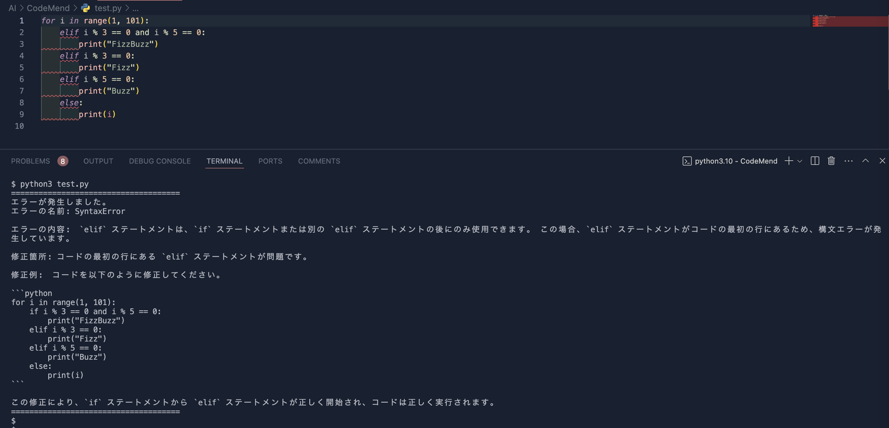

<h1 align="center">CodeMend</h1>




# 🌟**はじめに**

CodeMendは、Pythonプログラムのエラーを自動的に診断し、改善のための提案を行うパッケージです。このパッケージは、リアルタイムでプログラムの標準出力とエラーをキャプチャし、エラーが発生した場合に外部APIを使用して詳細なエラー説明と修正提案を提供します。

---

## 主な機能

- **エラーハンドリング**: プログラムの実行時にエラーが発生した場合、エラーが発生したプログラムファイルとエラーメッセージを外部APIに送信し、エラーの詳細な説明と修正提案を取得します。

---

# 🚀 **インストール方法**

CodeMendは、以下の手順でインストールすることができます。

1. **Python 3.7以上がインストールされていることを確認してください。**
2. **ターミナルまたはコマンドプロンプトを開きます。**
3. **以下のコマンドを実行して、CodeMendをインストールします。**

```sh
pip install git+https://github.com/Accord33/CodeMend.git
```
# 📝 使い方

CodeMendを使用するためには、GeminiのAPIキーが必要です。<br>
pipでインストールした後、codemendコマンドを使用してCodeMendを実行できます。

環境変数の設定:
```GOOGLE_API_KEY```を設定してください。
CodeMendの実行:
python3コマンドを実行すると、エラーが発生した場合に提案を提供します。
それ以外の通常のコマンドに関しては、通常のように動作します。

# 🤝 コントリビューション

CodeMendはオープンソースプロジェクトです。皆さんのコントリビューションを歓迎します！

バグ報告や機能リクエスト: Issueページからお願いします。
プルリクエスト: 大歓迎です。

# 📄 ライセンス

CodeMendは、MITライセンスの下で公開されています。詳細は、LICENSEファイルを参照してください。